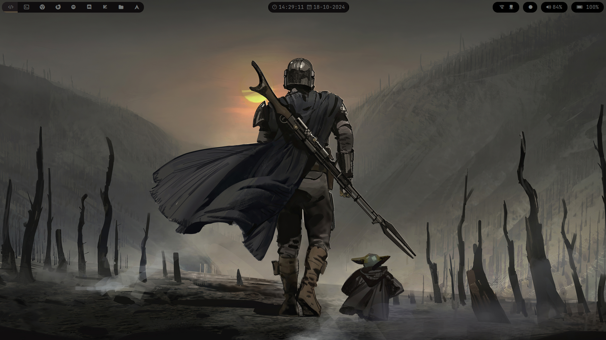
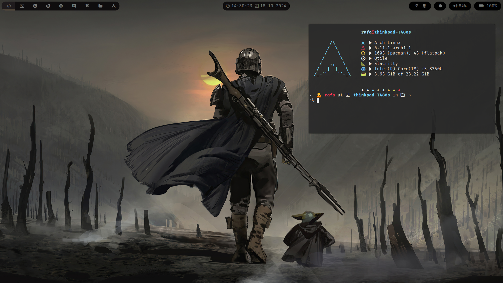
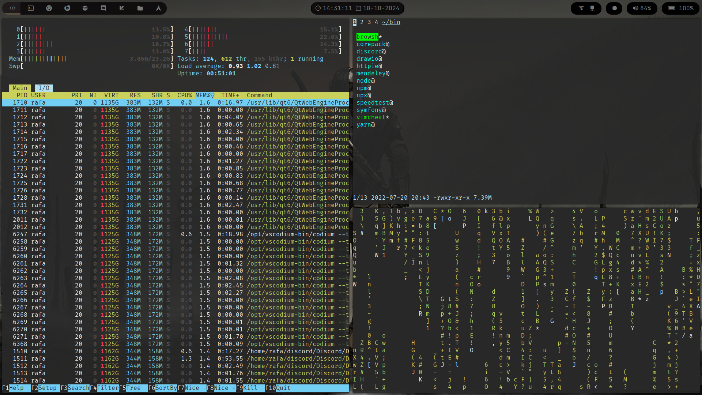

## My DotFiles

#### To install:

`Arch`

```
sudo pacman -S alacritty fastfetch feh picom polybar qtile rofi
```

Then clone this repository to you home directory

```
cd ~

git clone <this repo>
```

after that symlink all of the folders to you .config directory, default is `$HOME/.config`

```
ln -s $HOME/.dotfiles/alacritty $HOME/.config/alacritty

ln -s $HOME/.dotfiles/fastfetch $HOME/.config/fastfetch

ln -s $HOME/.dotfiles/picom $HOME/.config/picom

ln -s $HOME/.dotfiles/polybar $HOME/.config/polybar

ln -s $HOME/.dotfiles/qtile $HOME/.config/qtile

ln -s $HOME/.dotfiles/rofi $HOME/.config/rofi
```

To install the wallpaper you can put it on `$HOME/wallpapers/current.jpg` that is where feh will look for default, to change this you can alter the autostart script on `$HOME/.dotfiles/qtile/autostart.sh` to whatever value you want.

All done you can now start using your custom qtile rice.

### Examples






